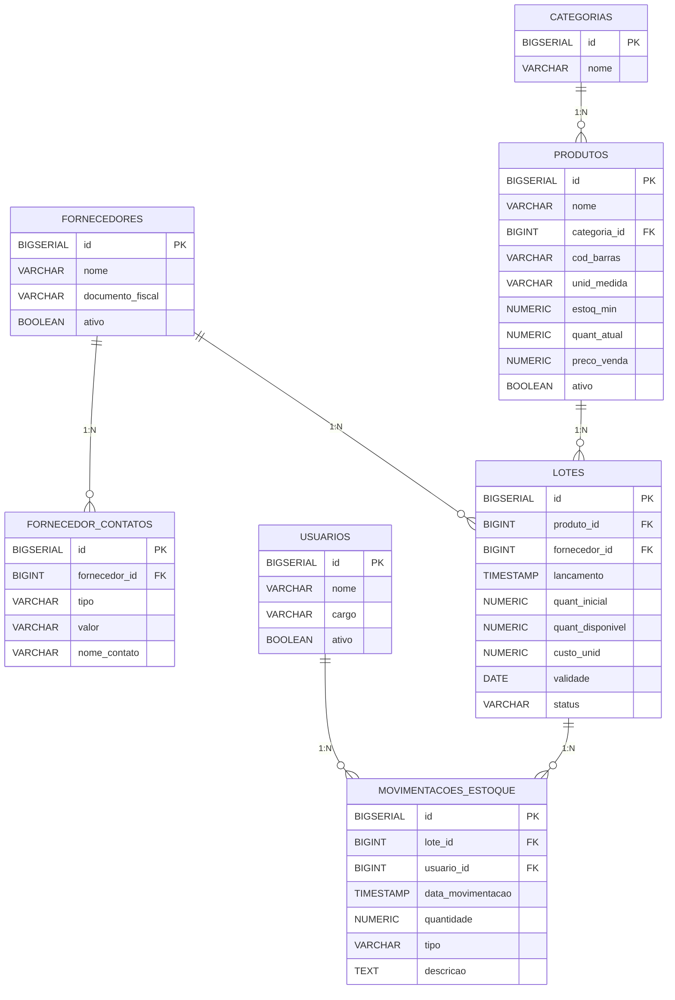

# Visio Varejo — Retail Inventory API (Work in Progress)

    

Uma API REST para controlar estoque de varejo com foco em integridade de dados, rastreabilidade (auditoria por usuário) e redução de perdas por validade/rotatividade. Resolve problemas comuns de varejo: inconsistências no saldo, falta de rastreabilidade por lote e operações concorrentes.

---

## Diferenciais de engenharia
- Arquitetura baseada em Spring Boot + Spring Data JPA com Flyway para migrações (V1__create_base_tables.sql presente). Java 21, Maven Wrapper.
- Modelagem relacional inicial pronta: Categorias, Produtos, Fornecedores, Contatos, Usuários, Lotes e Movimentações (ver migration V1).
- Tratamento global de exceções via GlobalExceptionHandler:
  - EntidadeNaoEncontradaException → HTTP 404
  - RegraNegocioException → HTTP 400
- Inativação lógica (soft delete) por flag boolean `ativo` em entidades (Produto, Fornecedor, Usuario) para preservação de histórico transacional.
- Domínio Produto/Categoria blindado por design e testes unitários; ProdutoService fornece listagem com join fetch e validações defensivas.
- Domínio Fornecedores:
  - Entidade Fornecedor com lista de FornecedorContato (`@OneToMany(mappedBy="fornecedor", cascade = CascadeType.ALL, orphanRemoval = true)`).
  - Método defensivo `adicionarContato(FornecedorContato contato)` garante consistência bidirecional em memória antes do flush.
  - FornecedorService implementado via TDD com `@Transactional` para persistência em lote e verificação "fail fast" de documento fiscal (CNPJ) duplicado (IFornecedorRepository#findByDocumentoFiscal).
- Entidades já modeladas para o motor de lotes: `Lote` (quant_inicial, quant_disponivel, validade, custo_unid, status) e `MovimentacaoEstoque` (tipo, quantidade, vínculo com `usuario` para auditoria).

---
## Roadmap — Fases e status
- Fase 1 — Fechamento dos Cadastros
  - - [x] Infraestrutura inicial: schema SQL / Flyway
  - - [x] Tratamento global de exceções (GlobalExceptionHandler)
  - - [x] Modelos base: Fornecedor, FornecedorContato, Produto, Categoria, Usuario
  - - [x] Serviço de Fornecedor: criação com persistência de contatos e validação de documento (FornecedorService.criar)
  - - [ ] CRUD completo de Fornecedores (paginação, atualização, inativação UI/Endpoints REST completos)
  - - [ ] Módulo de Usuários (operadores/gerentes para auditoria — sem JWT no momento)
- Fase 2 — Motor de Estoque por Lote (FIFO/FEFO)
  - - [x] Entidade Lote com campos essenciais (quant_inicial, quant_disponivel, validade, status)
  - - [ ] Atualização atômica de `quant_atual` em Produto ao salvar Lote (sincronização @Transactional entre Lote e Produto)
  - - [ ] Regras de vencimento / status de lote (VENCIDO, ESGOTADO, DESCARTADO)
- Fase 3 — Saídas e Baixas (Consumo inteligente)
  - - [ ] Entidade MovimentacaoEstoque operacionalizada (tipos: VENDA, DESCARTE, AVARIA, AJUSTE_MANUAL)
  - - [ ] Lógica de consumo por lote (FIFO/FEFO): consumir do lote mais antigo/próximo do vencimento; se estourar, abater do próximo lote
  - - [ ] Vincular obrigatoriamente `usuario_id` em movimentações para auditoria
  - - [ ] Auditoria e histórico de movimentações (read models / endpoints)
- Fase 4 — Controllers, Validação e Documentação
  - - [ ] REST Controllers finais (endpoints paginados, filtros)
  - - [ ] Validação de entrada com Bean Validation nos DTOs (@NotBlank, @Email, @Size — já presente em DTOs como ProdutoRequestDTO)
  - - [ ] Documentação OpenAPI / Swagger (springdoc) e exemplos de uso

---

## Destaque técnico: o desafio da concorrência
Em operações de saída (ex.: venda), dois operadores podem tentar consumir o mesmo saldo simultaneamente. Estratégia proposta:
- Camada de domínio isolada e transações curtas com @Transactional.
- Preferência por Optimistic Locking (campo @Version) em entidades críticas (Produto, Lote) para detectar conflitos e re-tentar a operação no nível da aplicação.
- Pessimistic Locking (LockModeType.PESSIMISTIC_WRITE) usado em cenários de alto contencioso onde re-tentativas são custosas.
- Em operações que alteram múltiplas linhas (consumo por lotes), usar checagens e updates atômicos dentro da mesma transação para garantir consistência do inventário.

Planejamento prático: implementar @Version em Produto/Lote na fase de transações (Fase 3), realizar testes de carga e testes de integração simulando concorrência.

---

## Tecnologias e dependências chave
- Linguagem: Java 21
- Framework: Spring Boot 4.1.0 (Web MVC, Data JPA, Validation)
- Persistência: Hibernate (JPA) + PostgreSQL 16
- Migrations: Flyway
- Documentação: springdoc-openapi (starter)
- Build: Maven (mvnw)
- Testes: JUnit (dependências de teste Spring Boot incluídas)
- Containerização: Docker Compose (Postgres service)

Arquivos notáveis:
- src/main/java/.../api/exception/GlobalExceptionHandler.java
- src/main/java/.../domain/exception/{EntidadeNaoEncontradaException, RegraNegocioException}.java
- src/main/java/.../domain/model/{Fornecedor,FornecedorContato,Produto,Lote,MovimentacaoEstoque,Usuario,Categoria}.java
- src/main/java/.../domain/service/{FornecedorService,ProdutoService}.java
- src/main/resources/db/migration/V1__create_base_tables.sql
- docker-compose.yml
- application.yml (usar variáveis de ambiente para senha)

---

## Como executar
1. Clone o repositório:
   - git clone https://github.com/eduardofbom/stock-manager-api.git
   - cd stock-manager-api
2. Variáveis de ambiente
   - Copie e configure: cp .env.example .env
   - Edite `.env` e defina DB_PASSWORD (ou export DB_PASSWORD=...).
3. Subir Postgres via Docker Compose:
   - docker compose up -d
   - (o serviço expõe Postgres na porta 5433 conforme docker-compose.yml)
4. Aplicação (Flyway aplicará V1 automaticamente no startup):
   - ./mvnw spring-boot:run
   - A aplicação usa application.yml e tentará conectar em jdbc:postgresql://localhost:5433/eduardofbom_stock
5. Executar testes:
   - ./mvnw test

Observações:
- Flyway está habilitado (baseline-on-migrate: true). As migrations estão em src/main/resources/db/migration.
- DTOs já usam Bean Validation (ex.: ProdutoRequestDTO). GlobalExceptionHandler traduz exceções do domínio em respostas HTTP padronizadas.

---

## Contribuindo / próximos passos técnicos
- Submeter PRs com escopo limitado por feature/fase (ver roadmap).
- Priorizar testes de integração para fluxos de estoque (Fase 2/3) e cenários concorrentes (testes que simulam múltiplos consumidores).
- Incluir métricas básicas (Prometheus) e logs estruturados para auditoria de movimentações.
- Adicionar exemplos OpenAPI com contratos de request/response para facilitar integração com frontend/PDV.